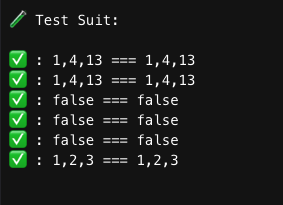

# Solution Challenge 01

Se implementó la solución en el archivo solution.php
Se tiene una región para los test delimitado por REGION TEST - ENDREGION TEST
Se uso metodo nativo de ordenamiento optimizando el uso de memoria y rapidez

# Pruebas

```php
function runTestSuit()
{
echo "\n\n🧪 Test Suit:\n\n";
assertEquals("1,4,13",findPoint(['1, 3, 4, 7, 13', '1, 2, 4, 13, 15']));
assertEquals("1,4,13",findPoint(['1, 2, 4, 13, 15','1, 3, 4, 7, 13']));
assertEquals("false",findPoint(['1, 3, 4, 7, 13','']));
assertEquals("false",findPoint(['','1, 3, 4, 7, 13']));
assertEquals("false",findPoint(['','']));
assertEquals("1,2,3",findPoint(['1,2,3','1,2,3']));
}
```


