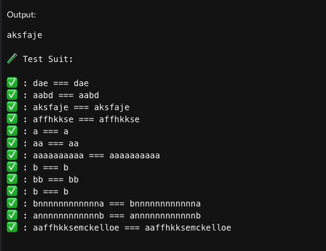

# Solution Challenge 02

- Se implementó la solución en el archivo solution.php.
- Se tiene una región para los test delimitado por REGION TEST - ENDREGION TEST.
- Se uso método recursivo para ir buscando las combinaciones posibles.

# Pruebas

```php
function runTestSuit()
{
    echo "\n\n🧪 Test Suit:\n\n";

    assertEquals("dae", noIterate(["aaabaaddae", "aed"]));
    assertEquals("aabd", noIterate(["aabdccdbcacd", "aad"]));
    assertEquals("aksfaje", noIterate(["ahffaksfajeeubsne", "jefaa"]));
    assertEquals("affhkkse", noIterate(["aaffhkksemckelloe", "fhea"]));

    assertEquals("a", noIterate(["aaaaaaaaaa", "a"]));
    assertEquals("aa", noIterate(["aaaaaaaaaa", "aa"]));
    assertEquals("aaaaaaaaaa", noIterate(["aaaaaaaaaa", "aaaaaaaaaa"]));
    assertEquals("b", noIterate(["aaaaaaaaab", "b"]));
    assertEquals("bb", noIterate(["aaaaaaaabb", "bb"]));
    assertEquals("b", noIterate(["aaaabaaaaa", "b"]));
    assertEquals("bnnnnnnnnnnnna", noIterate(["bnnnnnnnnnnnna", "ab"]));
    assertEquals("annnnnnnnnnnnb", noIterate(["annnnnnnnnnnnb", "ab"]));
    assertEquals("aaffhkksemckelloe", noIterate(["aaffhkksemckelloe", "aaffhkksemckelloe"]));
}
```


